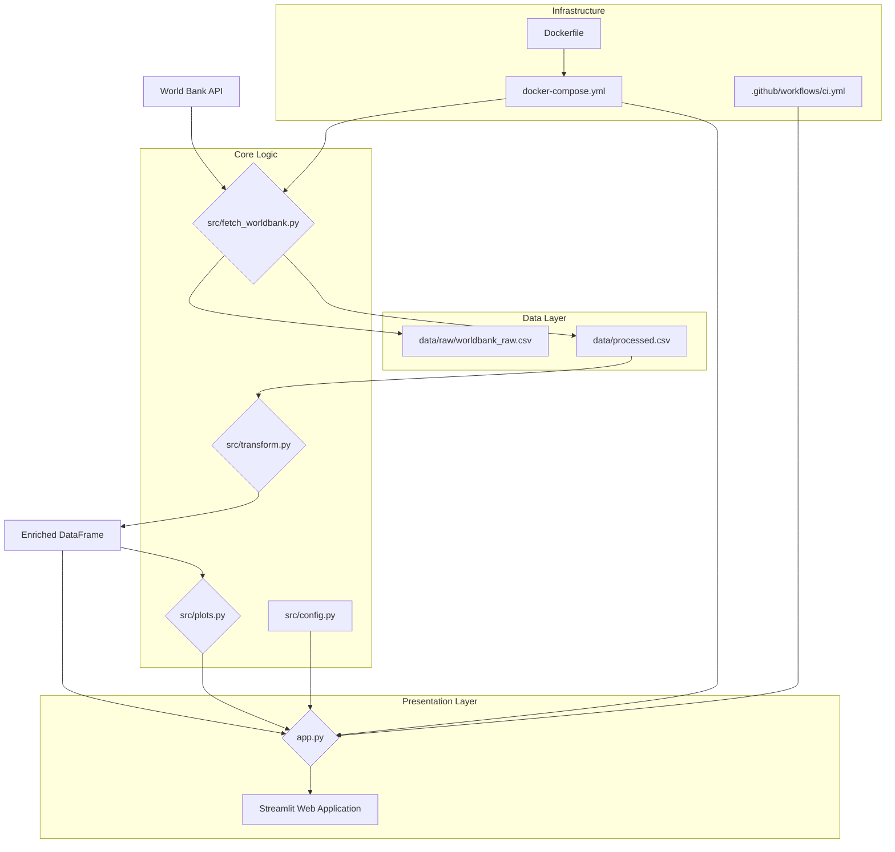

# Economic Insights Dashboard 📈

## Unveiling Global Economic Trends Through Interactive Visualization

This project presents a sophisticated Streamlit-powered dashboard designed for in-depth exploration and analysis of key economic indicators sourced from the World Bank. It provides a dynamic platform for understanding global economic trends, dissecting metric relationships, and evaluating country-specific performance with a focus on data-driven insights.

## ✨ Core Features

Leveraging a robust data pipeline and an intuitive user interface, the Economic Insights Dashboard offers a rich set of functionalities:

*   **Interactive Data Exploration:** Engage with economic indicators through interactive charts and customizable controls, allowing for granular analysis.
*   **Time Series Analysis:** Compare and contrast economic trends across diverse countries over specified periods, facilitating historical and comparative studies.
*   **Metric Relationships:** Uncover intricate connections between various economic indicators using advanced visualization techniques, including correlation heatmaps and scatter plots.
*   **Dynamic Metric Descriptions:** Contextual information is provided for each selected metric, ensuring clarity and enhancing user understanding of complex economic terms.
*   **User-Centric Interface:** Engineered for optimal usability, the dashboard features a refined layout, streamlined navigation, and an intuitive metric selection process.
*   **Advanced Data Transformation Layer:** A meticulously designed data pipeline ensures data quality and analytical readiness through:
    *   **Forward Filling:** Intelligent handling of missing data points on a per-country basis to maintain data integrity.
    *   **Z-Score Standardization:** Normalization of key metrics to their historical means and standard deviations, enabling meaningful cross-country and temporal comparisons.
    *   **Feature Engineering:** Creation of insightful composite metrics, such as the **Misery Index** (Unemployment + Inflation) and the **Debt-to-Growth Ratio** (Government Debt / GDP Growth), to provide deeper economic perspectives.
*   **Containerized Environment (Docker):** The entire application is encapsulated within Docker containers, guaranteeing a consistent, reproducible, and isolated development and deployment environment.
*   **Automated Data Fetching:** Integration with the World Bank API ensures that the dashboard operates with up-to-date economic data, fetched programmatically.

## 🏛️ Architectural Blueprint

The project adheres to a modular and layered architectural design, emphasizing maintainability, scalability, and a clear separation of concerns. This structure facilitates independent development and robust integration of components.



### Component Breakdown:

*   **`data/`**: The central repository for all project data.
    *   `data/raw/worldbank_raw.csv`: Stores the raw, unadulterated data directly retrieved from the World Bank API.
    *   `data/processed.csv`: Contains the initial cleaned and pre-processed dataset, serving as the input for subsequent transformations.

*   **`src/`**: Encompasses the core Python application logic.
    *   **`src/fetch_worldbank.py`**: This module is responsible for programmatic interaction with the World Bank API. It fetches specified economic indicators for a defined set of countries and years, then persists this data into both raw and processed CSV formats.
    *   **`src/transform.py`**: Implements the critical data transformation pipeline. Key operations include:
        *   **Forward Filling:** Strategically fills missing data points within each country's time series, preventing data leakage and ensuring continuity.
        *   **Z-Score Standardization:** Normalizes key economic indicators on a per-country basis, allowing for robust comparisons against historical averages.
        *   **Feature Engineering:** Generates new, insightful composite metrics such as the **Misery Index** (`unemployment_rate + inflation_cpi`) and the **Debt-to-Growth Ratio** (`gov_debt_pct_gdp / gdp_growth`), providing deeper analytical dimensions.
    *   **`src/plots.py`**: A dedicated library for generating high-quality, interactive visualizations. It encapsulates functions for creating time-series plots, correlation heatmaps, and scatter plots using Plotly Express, ensuring consistent and visually appealing outputs.
    *   **`src/config.py`**: Serves as the centralized configuration hub for the application. It defines all economic metrics, their user-friendly display names, and detailed descriptions, promoting modularity and ease of content management.
    *   **`app.py`**: The main entry point for the Streamlit web application. It orchestrates the entire user experience, from loading the transformed data and rendering the interactive user interface (including dynamic tabs, selectors, and metric descriptions) to invoking the plotting functions for visualization.

*   **`Dockerfile`**: A blueprint for building the Docker image of the application. It specifies the Python environment, required dependencies, and the command to initiate the Streamlit application within the container.

*   **`docker-compose.yml`**: Facilitates the orchestration of multi-container Docker applications. It defines and manages services for data fetching (`data-fetcher`) and the Streamlit dashboard (`app`), handling their interdependencies, volume mounts for data persistence, and network port mappings.

*   **`.github/workflows/ci.yml`**: Configures the Continuous Integration (CI) pipeline using GitHub Actions. This workflow automates code quality checks, such as linting, on every pull request, ensuring adherence to coding standards and early detection of issues.

*   **`docs/`**: A comprehensive documentation directory containing detailed implementation plans for each feature (`feature-01-data-fetch.md`, `feature-02-transform.md`, etc.) and a `data-dictionary.md` that defines all data fields and engineered features.

## 🚀 Getting Started

This section provides instructions for setting up and running the Economic Insights Dashboard. You can choose between a containerized setup using Docker (recommended for consistency) or a local Python environment.

### Prerequisites

*   **Python 3.8+**: Required for local development.
*   **Docker**: Essential for running the application in a containerized environment.

### Running with Docker (Recommended)

Utilizing Docker ensures a consistent, isolated, and reproducible environment, eliminating dependency conflicts and simplifying setup.

1.  **Build and Launch Containers:**
    Navigate to the root directory of the project in your terminal and execute the following command:
    ```bash
    docker-compose up --build
    ```
    This command performs several actions:
    *   It builds the Docker image for the application (if not already cached).
    *   It initiates the `data-fetcher` service, which automatically executes `src/fetch_worldbank.py` to download and process the latest World Bank economic data.
    *   It then starts the `app` service, launching the interactive Streamlit dashboard.

    > **Note:** The `data-fetcher` service is configured to run and complete successfully before the Streamlit application (`app` service) starts, ensuring all necessary data files are available.

2.  **Access the Dashboard:**
    Once all services are up and running (this may take a few moments for initial data fetching and image build), open your web browser and navigate to:
    [http://localhost:8501](http://localhost:8501)

    > **Port Conflict:** If port `8501` is already in use on your local machine, you may need to modify the port mapping within the `docker-compose.yml` file to an available port.

### Running Locally (Python Environment)

For developers who prefer a direct Python environment setup:

1.  **Clone the Repository:**
    Begin by cloning the project repository to your local machine:
    ```bash
    git clone https://github.com/your-username/economic-insights-dashboard.git
    cd economic-insights-dashboard
    ```

2.  **Set Up Virtual Environment:**
    It is highly recommended to use a Python virtual environment to manage project dependencies:
    ```bash
    python -m venv .venv
    # On Windows, activate with:
    .venv\Scripts\activate
    # On macOS/Linux, activate with:
    source .venv/bin/activate
    ```

3.  **Install Dependencies:**
    Install all required Python packages using `pip`:
    ```bash
    pip install -r requirements.txt
    ```

4.  **Fetch Initial Data:**
    Execute the data fetching script to download the necessary economic indicators from the World Bank API and save them locally:
    ```bash
    python src/fetch_worldbank.py
    ```
    This will generate:
    *   `data/raw/worldbank_raw.csv`
    *   `data/processed.csv`

5.  **Launch Streamlit Dashboard:**
    Finally, start the interactive Streamlit application:
    ```bash
    streamlit run app.py
    ```
    Your default web browser will automatically open to the dashboard interface.

## 🧪 Testing & Quality Assurance

Maintaining code quality and ensuring functional integrity are paramount. The project incorporates practices to support robust development:

*   **Manual Verification:** After deploying or running the application, thorough manual interaction with the dashboard is encouraged to confirm that all features (time-series plots, correlation heatmaps, scatter plots, dynamic metric descriptions) operate as expected and provide accurate insights.
*   **Linting (Ruff):** Code style and quality are enforced using `ruff`, a highly performant Python linter. You can manually run the linter across the codebase:
    ```bash
    ruff check .
    ```
    Additionally, a GitHub Actions CI pipeline is configured to automatically perform linting checks on every pull request, ensuring consistent code quality before integration.

## 🤝 Contributing

We welcome and appreciate contributions to the Economic Insights Dashboard! Whether you have suggestions for new features, improvements to existing functionalities, bug reports, or code contributions, please feel free to:

*   Open an [issue](https://github.com/your-username/your-repo/issues) to discuss proposed changes or report bugs.
*   Submit a [pull request](https://github.com/your-username/your-repo/pulls) with your code contributions. Please ensure your code adheres to the project's style guidelines and passes all linting checks.

---

**Data Source:** World Bank Indicators
