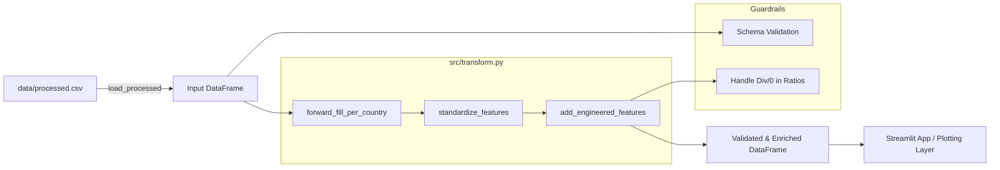

Of course. Here is the corrected document with the fixed Mermaid diagram and re-numbered section titles.

The primary issue in the Mermaid diagram was the use of parentheses `()` within node labels, which is invalid syntax. These have been removed. The section numbering has also been corrected to be sequential.

---

## Feature 02 — Transform & Feature Engineering

**Branch:** `feature/transform-pipeline` → PR into `dev`
**Owner:** Arsh
**Status:** Draft → In Progress → Review → Merged

---

### 1. Goal

Build a reusable, testable Python module (`src/transform.py`) that takes the processed data from Feature 1 and applies common transformations: forward-filling sparse data, standardizing key metrics for comparability (Z-scores), and creating new, insightful engineered features. This layer provides a clean, analysis-ready DataFrame for the Streamlit app and any future modeling.

### 2. Deliverables

*   `src/transform.py`: A Python module containing the transformation functions.
*   `tests/test_transform.py`: Unit tests for the transformation logic using `pytest`.
*   `docs/feature-02-transform.md`: This implementation plan.
*   `docs/data-dictionary.md`: **Updated** with new `_z` and engineered columns.
*   `README.md`: **Updated** with a new "Transform Layer" section explaining the purpose of `src/transform.py`.

---

### 3. Scope

#### In

*   **Data Input:** Reads `data/processed.csv`.
*   **Forward Fill:** A `forward_fill_per_country` function that correctly fills missing values *within* each country's time series, preventing data leakage across countries.
*   **Standardization (Z-score):** A `standardize_features` function that calculates Z-scores (`_z` suffix) for numeric indicators. This normalization is also performed on a per-country basis to compare a value against its own historical mean.
*   **Feature Engineering:** An `add_engineered_features` function to create composite metrics:
    *   `misery_index`: `unemployment_rate + inflation_cpi`. A classic indicator of economic distress.
    *   `debt_to_growth_ratio`: `gov_debt_pct_gdp / gdp_growth`. A simple ratio to gauge if economic growth is keeping pace with debt accumulation (lower is better; handle division by zero).
    *   `external_balance_health`: `current_account_pct_gdp` (renamed for clarity, can be expanded later).
*   **Schema Validation:** A lightweight `validate_schema` function to ensure required input columns exist before transforming.
*   **Orchestration:** A main `build_dataset()` function that chains these transformations together.

#### Out

*   Fetching new data (handled by `fetch_worldbank.py`).
*   Complex time-series analysis (e.g., seasonal decomposition, ARIMA).
*   Data visualization (handled by `src/plots.py` in the next feature).
*   Saving the transformed data to a new CSV file (for now, transforms will be applied in-memory by the app).

---

### 4. Architecture

The transform module will act as a processing pipeline, consuming the clean CSV and outputting an enriched DataFrame for downstream use.



---

### 5. Schema Definition

#### Input Schema (`data/processed.csv`)

| column                | type  | notes                            |
| --------------------- | ----- | -------------------------------- |
| country.value         | str   | Country full name                |
| countryiso3code       | str   | ISO3 code                        |
| date                  | int   | Year                             |
| gdp\_growth            | float | May contain NaNs                 |
| inflation\_cpi          | float | May contain NaNs                 |
| unemployment\_rate     | float | May contain NaNs                 |
| gov\_debt\_pct\_gdp     | float | May contain NaNs                 |
| current\_account\_pct\_gdp | float | May contain NaNs                 |

#### Output Schema (Enriched DataFrame)

The output DataFrame will contain all input columns plus the following additions:

| column                  | type  | notes                                                   |
| ----------------------- | ----- | ------------------------------------------------------- |
| `gdp_growth_z`          | float | Z-score, normalized per country                         |
| `inflation_cpi_z`       | float | Z-score, normalized per country                         |
| `unemployment_rate_z`   | float | Z-score, normalized per country                         |
| `gov_debt_pct_gdp_z`      | float | Z-score, normalized per country                         |
| `current_account_pct_gdp_z` | float | Z-score, normalized per country                         |
| `misery_index`          | float | `unemployment_rate + inflation_cpi`                     |
| `debt_to_growth_ratio`  | float | `gov_debt_pct_gdp / gdp_growth`                         |
| `external_balance_health` | float | `current_account_pct_gdp` (alias for clarity) |

---

### 6. Implementation Details / Technical Approach

*   **`forward_fill_per_country(df)`**:
    *   Use `df.groupby('countryiso3code').transform(lambda x: x.ffill())`.
    *   This ensures that the last valid observation for a metric in the US is not used to fill a missing value for Brazil.
*   **`standardize_features(df, metrics)`**:
    *   Use `df.groupby('countryiso3code')[metrics].transform(lambda x: (x - x.mean()) / x.std())`.
    *   Append `_z` suffix to the new columns.
*   **`add_engineered_features(df)`**:
    *   Calculate new columns using simple vectorized Pandas operations.
    *   For `debt_to_growth_ratio`, handle division by zero or near-zero `gdp_growth` by replacing resulting `inf` or `NaN` values with a placeholder (e.g., `NaN` or a large number).
*   **`build_dataset()`**:
    *   Define the main entry point that loads `data/processed.csv` and applies the sequence of transformations.
    *   This function will be imported and used by the Streamlit app.
*   **General**: Use clear function signatures with type hints and docstrings.

---

### 7. Error Handling & Edge Cases

*   **Missing Input Columns:** The `validate_schema` step should raise a `KeyError` with a clear message if a required column is not found in the input DataFrame.
*   **All-NaN Series:** The `standardize_features` function should gracefully handle cases where a country's entire series for a metric is `NaN` (the standard deviation will be zero). The result should be a series of `NaN`s.
*   **Division by Zero:** Explicitly handle `gdp_growth` being zero in the `debt_to_growth_ratio` calculation to avoid `inf` values.

---

### 8. Definition of Done

*   [ ] `src/transform.py` is created with the specified functions (`forward_fill_per_country`, `standardize_features`, `add_engineered_features`, `build_dataset`).
*   [ ] `tests/test_transform.py` is created with meaningful unit tests for the core logic.
*   [ ] All tests pass locally (`pytest`).
*   [ ] `README.md` is updated to describe the new transform capabilities.
*   [ ] `docs/data-dictionary.md` is updated to include definitions for all new columns.
*   [ ] The code is well-documented with type hints and docstrings.
*   [ ] A PR is opened to `dev` from `feature/transform-pipeline`.

---

### 9. File Manifest

Files created or modified in this feature:

```
src/transform.py
tests/test_transform.py
docs/feature-02-transform.md
docs/data-dictionary.md
README.md
```

---

### 10. Conventional Commits

*   `feat(transform): add forward-fill and z-score standardization`
*   `feat(transform): implement misery index and debt-to-growth engineered features`
*   `test(transform): add unit tests for ffill and standardization logic`
*   `docs(readme): add section on data transformation layer`

---

### 11. Pull Request Template

**Title:** `feat: add data transformation pipeline (ffill, zscore, engineered metrics)`

**Summary:**
This PR introduces a new module, `src/transform.py`, responsible for preparing the processed data for analysis and visualization. It chains together several key transformations:
1.  **Forward Fill:** Fills missing data points on a per-country basis.
2.  **Z-Score Standardization:** Normalizes key indicators for historical comparison within each country.
3.  **Feature Engineering:** Adds composite metrics like the Misery Index.

This reusable layer will be directly consumed by the plotting utilities and the Streamlit application. All logic is covered by unit tests in `tests/test_transform.py`.

**Checklist:**
*   [ ] `src/transform.py` created and documented.
*   [ ] `tests/test_transform.py` created.
*   [ ] Tests pass locally.
*   [ ] `README.md` and `docs/data-dictionary.md` have been updated.
*   [ ] The code adheres to project styling and quality standards.