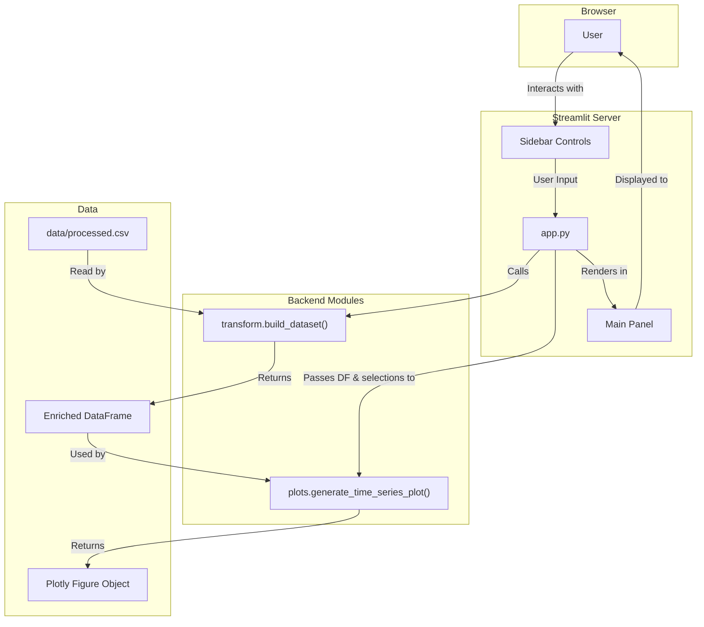

## Feature 03 — Interactive Dashboard with Streamlit

### 1. Goal

Develop an interactive web application using Streamlit that serves as the primary user interface for exploring the economic data. The app will consume the analysis-ready DataFrame from the `transform` module (Feature 2), allowing users to dynamically select countries and metrics to visualize in a time-series plot.

### 2. Deliverables

*   `app.py`: The main entry point for the Streamlit application.
*   `src/plots.py`: A new, reusable Python module for generating Plotly visualizations.
*   `docs/feature-03-dashboard.md`: This implementation plan.
*   `requirements.txt`: **Updated** to include `streamlit` and `plotly`.
*   `README.md`: **Updated** with a "Running the Application" section detailing how to launch the Streamlit app.

---

### 3. Scope

#### In

*   **Application Framework:** Use Streamlit for the web application.
*   **Data Loading:** The app will import and use the `transform.build_dataset()` function to get the final, enriched DataFrame in memory.
*   **User Controls (Sidebar):**
    *   A multi-select widget to choose one or more countries for comparison.
    *   A select box (dropdown) to choose a single metric to plot on the y-axis (e.g., `gdp_growth`, `misery_index`, `inflation_cpi_z`).
*   **Visualization:**
    *   A primary time-series line chart (using Plotly) in the main area of the app, showing the selected metric over time for the selected countries.
    *   The chart should have a clear title, axis labels, and a legend.
*   **Data Preview:** An expandable section (`st.expander`) below the chart that displays the filtered data table used for the plot.
*   **Decoupled Plotting:** Plot generation logic will reside in `src/plots.py` to keep `app.py` clean and focused on UI orchestration.

#### Out

*   User authentication or accounts.
*   Deployment configurations (e.g., Dockerfile, cloud deployment scripts).
*   Advanced visualizations like scatter plots, correlation heatmaps, or geo maps.
*   Saving or exporting charts and data from the UI.
*   Direct database connections.

---

### 4. Architecture

The application follows a simple, clean architecture where the Streamlit UI script (`app.py`) orchestrates calls to the data transformation layer and the new plotting layer.



---

### 5. UI/UX Mockup (Text-based)

The application will have a two-column layout: a sidebar for controls and a main area for content.

```
+--------------------------------+----------------------------------------------------+
| [SIDEBAR]                      | [MAIN PANEL]                                       |
|                                |                                                    |
| 📈 Economic Dashboard          | <h1>GDP Growth Rate Comparison</h1>               |
|                                |                                                    |
| ---                            | +------------------------------------------------+ |
|                                | |                                                | |
| **Controls**                   | | [Interactive Plotly Line Chart]                | |
|                                | |                                                | |
| Select Countries:              | +------------------------------------------------+ |
| [Multi-select Dropdown]        |                                                    |
| (e.g., United States, China)   |                                                    |
|                                | ▼ Show Plotted Data                                |
| Select Metric:                 | +------------------------------------------------+ |
| [Select Box Dropdown]          | | [Pandas DataFrame Table]                       | |
| (e.g., gdp_growth)             | +------------------------------------------------+ |
|                                |                                                    |
+--------------------------------+----------------------------------------------------+
```

---

### 6. Implementation Details / Technical Approach

*   **`app.py`:**
    *   Import `streamlit as st`, `src.transform as transform`, and `src.plots as plots`.
    *   Create a `load_data()` function decorated with `@st.cache_data` that calls `transform.build_dataset()`. This prevents reloading and reprocessing the data on every user interaction.
    *   Use `st.sidebar` to place all the widgets.
    *   The country multi-select (`st.multiselect`) will be populated from the unique `country.value` column in the DataFrame.
    *   The metric select box (`st.selectbox`) will have a predefined list of plottable columns.
    *   Filter the main DataFrame based on user selections.
    *   Call `plots.generate_time_series_plot()` with the filtered data.
    *   Render the returned figure using `st.plotly_chart(fig, use_container_width=True)`.
*   **`src/plots.py`:**
    *   Import `plotly.express as px` and `pandas as pd`.
    *   Create a function `generate_time_series_plot(df: pd.DataFrame, metric: str, title: str)`.
    *   Inside, use `px.line(df, x='date', y=metric, color='country.value', title=title)`.
    *   Update the layout with appropriate axis labels.
    *   The function will return a Plotly `Figure` object.
*   **`requirements.txt`:**
    *   Add `streamlit>=1.15`
    *   Add `plotly>=5.10`

---

### 7. Error Handling & Edge Cases

*   **No Data File:** If `data/processed.csv` is not found, `transform.build_dataset()` might raise an error. `app.py` should catch this `FileNotFoundError` and display a user-friendly message using `st.error()`.
*   **No Countries Selected:** If the user deselects all countries, the app should display an informational message (`st.info("Please select at least one country to display the chart.")`) instead of showing an empty plot or raising an error.
*   **Empty DataFrame to Plot:** The `generate_time_series_plot` function in `src/plots.py` should check if the input DataFrame is empty. If it is, it should return an empty `go.Figure()` to avoid crashing.

---

### 8. Definition of Done

*   [ ] `app.py` is created and successfully runs locally via `streamlit run app.py`.
*   [ ] `src/plots.py` is created with a reusable plotting function.
*   [ ] `tests/test_plots.py` exists and provides basic test coverage.
*   [ ] The application correctly loads data using the `transform` module.
*   [ ] Sidebar controls for country and metric selection are functional.
*   [ ] The time-series chart updates dynamically based on user input.
*   [ ] The `README.md` is updated with instructions on how to install dependencies and run the app.
*   [ ] `requirements.txt` is updated.
*   [ ] A PR is opened to `dev` from `feature/streamlit-dashboard`.

---

### 9. File Manifest

Files created or modified in this feature:

```
app.py
src/plots.py
tests/test_plots.py
docs/feature-03-dashboard.md
requirements.txt
README.md
```

---

### 10. Conventional Commits

*   `feat(ui): create streamlit app with sidebar controls`
*   `feat(plots): add function to generate plotly time-series chart`
*   `refactor(app): connect ui controls to data filtering and plotting logic`
*   `docs(readme): add instructions for running the streamlit dashboard`
*   `chore(deps): add streamlit and plotly to requirements.txt`

---

### 11. Pull Request Template

**Title:** `feat: build interactive dashboard with streamlit`

**Summary:**
This PR introduces the main user-facing component of the project: an interactive Streamlit dashboard. It allows users to visualize and compare economic indicators across different countries and over time.

Key components:
1.  **`app.py`**: The main Streamlit application that handles UI layout and state.
2.  **`src/plots.py`**: A new, decoupled module for generating visualizations with Plotly Express.
3.  **Data Integration**: The app consumes the enriched DataFrame produced by the `src/transform.py` module, ensuring a clean data flow.
4.  **User Controls**: Interactive widgets in the sidebar allow for dynamic filtering and plotting.

The `README.md` has been updated with instructions on how to run the application locally.

**Checklist:**
*   [ ] `app.py` and `src/plots.py` created and documented.
*   [ ] Application runs locally without errors.
*   [ ] All UI controls are functional.
*   [ ] `README.md` and `requirements.txt` have been updated.
*   [ ] The code adheres to project styling and quality standards.