## Feature 04 — Automation & Containerization

**Branch:** `feature/docker-ci` → PR into `dev`
**Owner:** Lena
**Status:** Draft → In Progress → Review → Merged

---

### 1. Goal

Containerize the entire application using Docker to ensure a consistent, reproducible environment for all developers and for future deployment. Implement a Continuous Integration (CI) pipeline using GitHub Actions to automate code style checks (linting), guaranteeing code consistency before it is merged.

### 2. Deliverables

*   `Dockerfile`: A file that defines the steps to build a portable Docker image of the application.
*   `.dockerignore`: A file to exclude unnecessary files (e.g., `.git`, `__pycache__`) from the Docker image, keeping it lightweight.
*   `docker-compose.yml`: A configuration file to easily manage and run the application container, including port mapping and volume mounts for development.
*   `.github/workflows/ci.yml`: A GitHub Actions workflow definition that automatically runs a linter on every pull request to the `dev` branch.
*   `Makefile` (Optional but Recommended): A simple file to abstract common commands like `make build` and `make run`.
*   `README.md`: **Updated** with a new "Running with Docker" section and a CI status badge.

---

### 3. Scope

#### In

*   **Dockerization:**
    *   Create a multi-stage `Dockerfile` to build a production-ready, slim image for the application.
    *   Create a `docker-compose.yml` file for a seamless local development experience. It will:
        *   Build the Docker image from the `Dockerfile`.
        *   Map the container port (8501) to the host machine.
        *   Mount the source code as a volume to allow for live-reloading during development.
*   **Continuous Integration (CI):**
    *   Set up a GitHub Actions workflow that is triggered on pull requests targeting the `dev` branch.
    *   The CI pipeline will have one main job:
        1.  **Linting:** Check the code against style guides using a tool like `ruff` or `black`/`flake8`.
    *   The pull request will be blocked from merging if the linting check fails.
*   **Data Fetching Integration:** Add a service to `docker-compose.yml` to run the `fetch_worldbank.py` script, ensuring data is available before the main app starts.

#### Out

*   **Automated Testing in CI:** The automatic execution of the `pytest` test suite within the CI pipeline is explicitly excluded. Testing will be performed manually as per the team's process.
*   **Continuous Deployment (CD):** Automatically deploying the application to a cloud provider.
*   **Image Registry:** Building and pushing the Docker image to a registry like Docker Hub or GitHub Container Registry (GHCR).

---

### 4. Architecture

This feature introduces two key workflows: a local development workflow using Docker Compose and an automated CI workflow in GitHub for linting.

```mermaid
flowchart TD
    subgraph "Local Development Workflow"
        A[Developer] -- runs --> B["`docker-compose up`"]
        B -- uses --> C[docker-compose.yml]
        C -- defines service for --> D[Data Fetcher Container]
        C -- defines service for --> E[Streamlit App Container]
        D -- runs --> F["`python src/fetch_worldbank.py`"]
        F -- creates --> G["data/processed.csv"]
        E -- depends on --> D
        E -- uses --> G
        A -- accesses app via --> H["localhost:8501"]
        E -- serves app to --> H
    end

    subgraph "CI Workflow (GitHub Actions)"
        I[Developer pushes to branch] -- creates PR to dev --> J[GitHub]
        J -- triggers --> K[CI Workflow: ci.yml]
        K -- runs on --> L[GitHub Runner]
        subgraph "Runner Steps"
            M["1. Checkout Code"]
            N["2. Setup Python & Install Dependencies"]
            O["3. Run Linter (ruff)"]
        end
        L --> M --> N --> O
        O -- Pass/Fail --> P[PR Status Check]
        P -- reports to --> J
    end
```



---

### 5. Implementation Details / Technical Approach

*   **`Dockerfile`:**
    *   Start from a slim Python base image (e.g., `python:3.10-slim`).
    *   Set a working directory: `WORKDIR /app`.
    *   Copy `requirements.txt` and install dependencies first to leverage Docker's layer caching. `RUN pip install --no-cache-dir -r requirements.txt`.
    *   Copy the rest of the application source code: `COPY . .`.
    *   Expose the Streamlit port: `EXPOSE 8501`.
    *   Define the command to run the application: `CMD ["streamlit", "run", "app.py", "--server.port=8501", "--server.address=0.0.0.0"]`.
*   **`docker-compose.yml`:**
    ```yaml
    version: '3.8'
    services:
      data-fetcher:
        build: .
        command: python src/fetch_worldbank.py
        volumes:
          - ./data:/app/data

      app:
        build: .
        ports:
          - "8501:8501"
        volumes:
          - ./src:/app/src
          - ./data:/app/data
        depends_on:
          - data-fetcher
    ```
*   **`.github/workflows/ci.yml`:**
    *   Use the `on: pull_request: branches: [ dev ]` trigger.
    *   Define a single job `lint`.
    *   Use standard actions: `actions/checkout@v3`, `actions/setup-python@v4`.
    *   Add steps to `pip install` requirements and then run `ruff check .`.

---

### 6. Error Handling & Edge Cases

*   **CI Failures:** The GitHub Actions workflow must be configured to fail the entire run if the linting step fails. This will block the PR from being merged.
*   **Port Conflicts:** The README should mention that if port 8501 is in use locally, the user can change it in the `docker-compose.yml` file.
*   **Data Volume:** The `docker-compose.yml` must correctly mount the `data` directory so that the data fetched by one container is available to the application container.

---

### 7. Definition of Done

*   [ ] `Dockerfile`, `.dockerignore`, and `docker-compose.yml` are created.
*   [ ] The application can be started successfully using `docker-compose up`.
*   [ ] The app, when run via Docker, reflects local code changes in `src` automatically.
*   [ ] A `.github/workflows/ci.yml` file is created and committed.
*   [ ] The CI pipeline is triggered on a new PR to `dev`.
*   [ ] The CI pipeline passes for code that meets quality standards.
*   [ ] The CI pipeline correctly fails for code with linting errors and blocks the PR.
*   [ ] `README.md` is updated with a CI badge and instructions for Docker.

---

### 8. File Manifest

Files created or modified in this feature:

```
.github/workflows/ci.yml
.dockerignore
Dockerfile
docker-compose.yml
Makefile
README.md
```

---

### 9. Conventional Commits

*   `build(docker): create Dockerfile and docker-compose for local development`
*   `ci(github): implement GitHub Actions workflow for linting`
*   `docs(readme): add CI badge and instructions for running with Docker`
*   `chore(repo): add Makefile for common development tasks`

---

### 10. Pull Request Template

**Title:** `build: containerize application and set up CI pipeline for linting`

**Summary:**
This PR prepares the project for robust development and future deployment by introducing two key components:
1.  **Dockerization**: The entire application is now containerized using Docker and Docker Compose. This provides a consistent and reproducible environment for all developers, eliminating "it works on my machine" issues. Run `docker-compose up` to start the application.
2.  **Continuous Integration (CI)**: A new GitHub Actions workflow has been implemented. It automatically runs a linter (`ruff`) on every pull request to the `dev` branch to ensure code style consistency.

These changes make the development process more reliable and are the first step towards automated deployment. **Note:** Automated testing is not part of this CI pipeline and will be handled manually.

**Checklist:**
*   [ ] `Dockerfile` and `docker-compose.yml` have been created and tested.
*   [ ] The application runs correctly via `docker-compose up`.
*   [ ] GitHub Actions CI pipeline is configured and passing for linting.
*   [ ] `README.md` has been updated with new instructions.
*   [ ] The code adheres to project styling and quality standards.