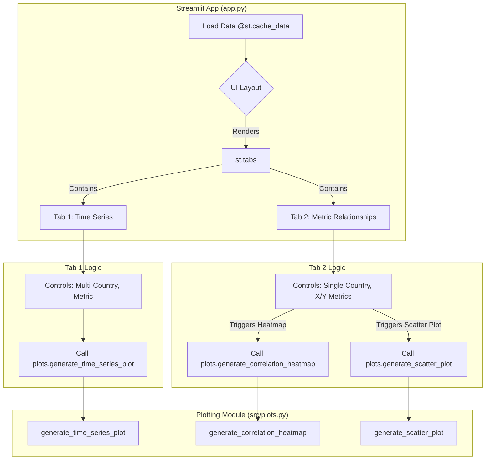

## Feature 05 — Advanced Visualizations & Dashboard Layout

**Branch:** `feature/advanced-plots` → PR into `dev`
**Owner:** Arsh
**Status:** Draft → In Progress → Review → Merged

---

### 1. Goal

Enhance the Streamlit dashboard by introducing more sophisticated visualizations and improving the user interface layout. This feature will add a correlation heatmap and a configurable scatter plot, allowing users to perform more in-depth exploratory data analysis directly within the application.

### 2. Deliverables

*   `app.py`: **Updated** with a new tabbed layout (`st.tabs`) and logic for the new visualizations.
*   `src/plots.py`: **Updated** with new functions to generate a correlation heatmap and a scatter plot.
*   `docs/feature-05-advanced-plots.md`: This implementation plan.
*   `README.md`: **Updated** to describe the new visualization features.

---

### 3. Scope

#### In

*   **Tabbed Interface:** Refactor the main UI in `app.py` to use `st.tabs`, creating separate sections for "Time Series Analysis" and "Metric Relationships".
*   **Correlation Heatmap:**
    *   In the "Metric Relationships" tab, create a section for a correlation heatmap.
    *   Add a **single select** dropdown for the user to choose one country.
    *   The heatmap will visualize the correlation matrix of the key numeric indicators for the selected country.
*   **Scatter Plot:**
    *   In the "Metric Relationships" tab, create a section for a scatter plot.
    *   Provide two select boxes for the user to choose a metric for the X-axis and a metric for the Y-axis.
    *   The plot will show the relationship between these two metrics for the country selected in the same tab.
*   **Decoupled Plotting Logic:** All new plot generation logic must be added to `src/plots.py`.

#### Out

*   3D plots or other highly complex visualizations.
*   Allowing users to plot data from multiple countries on the same heatmap or scatter plot.
*   Statistical overlays on plots (e.g., regression lines on the scatter plot).
*   Saving or exporting plots from the UI.

---

### 4. Architecture

The application's core architecture remains the same, but the UI orchestration within `app.py` becomes more sophisticated. It will now manage different "views" or "pages" via tabs, each with its own set of controls and plotting logic.



---

### 5. UI/UX Mockup (Text-based)

The application will be redesigned with a tabbed interface.

```
+--------------------------------+-------------------------------------------------------------+
| [SIDEBAR]                      | [MAIN PANEL]                                                |
|                                |                                                             |
| 📈 Economic Dashboard          | +----------------------+----------------------------------+ |
|                                | | Time Series Explorer | [Metric Relationships]           | |
| ---                            | +---------------------------------------------------------+ |
|                                | |                                                         | |
| [Sidebar controls for          | | [Existing UI: Multi-country select, metric select,      | |
|  Time Series Plot]             | |  and time-series line chart will now live in this tab]  | |
|                                | |                                                         | |
+--------------------------------+-------------------------------------------------------------+

// When user clicks on the "Metric Relationships" tab:

+--------------------------------+-------------------------------------------------------------+
| [SIDEBAR]                      | [MAIN PANEL]                                                |
|                                |                                                             |
| 📈 Economic Dashboard          | +----------------------+----------------------------------+ |
|                                | | Time Series Explorer | [Metric Relationships]           | |
| ---                            | +---------------------------------------------------------+ |
|                                | | Select a Country: [Dropdown: United States]             | |
| **Controls for Relationships** | | ---                                                     | |
|                                | | <h2>Correlation Heatmap</h2>                           | |
| Select Country:                | | [Plotly Heatmap showing corr matrix for the US]         | |
| [Dropdown: United States]      | |                                                         | |
|                                | | <h2>Scatter Plot Explorer</h2>                          | |
| Select X-Axis Metric:          | | X-Axis: [gdp_growth]  Y-Axis: [unemployment_rate]       | |
| [Dropdown: gdp_growth]         | | [Plotly Scatter Plot of X vs Y for the US]              | |
|                                | |                                                         | |
| Select Y-Axis Metric:          | +---------------------------------------------------------+ |
| [Dropdown: unemployment_rate]  |                                                             |
+--------------------------------+-------------------------------------------------------------+
```

---

### 6. Implementation Details / Technical Approach

*   **`app.py`:**
    *   Introduce `tab1, tab2 = st.tabs(["Time Series Explorer", "Metric Relationships"])`.
    *   Move the existing time-series controls and plot rendering logic inside a `with tab1:` block. It might be cleaner to move controls to the sidebar for a better user experience.
    *   Inside a `with tab2:` block:
        *   Create a single country selector: `country = st.selectbox(...)`.
        *   Filter the main DataFrame for that country: `country_df = df[df['country.value'] == country]`.
        *   Call `plots.generate_correlation_heatmap(country_df, ...)` and render it.
        *   Create two metric selectors for the scatter plot: `x_metric = st.selectbox(...)`, `y_metric = st.selectbox(...)`.
        *   Call `plots.generate_scatter_plot(country_df, x_metric, y_metric, ...)` and render it.
*   **`src/plots.py`:**
    *   **`generate_correlation_heatmap(df, metrics_to_correlate)`:**
        *   Calculate the correlation matrix: `corr_matrix = df[metrics_to_correlate].corr()`.
        *   Use `plotly.express.imshow(corr_matrix, text_auto=True, aspect="auto")` to generate the heatmap. `text_auto=True` displays the correlation values on the map.
    *   **`generate_scatter_plot(df, x_metric, y_metric)`:**
        *   Use `plotly.express.scatter(df, x=x_metric, y=y_metric, hover_name='date')`.
        *   Add a clear title and axis labels.

---

### 7. Edge Cases to Consider for Manual Testing

*   **Insufficient Data:** Manually test how the application behaves when a country is selected that has very few data points for the correlation or scatter plots.
*   **Identical Axes:** Check the behavior of the scatter plot when the same metric is selected for both the X and Y axes.

---

### 8. Definition of Done

*   [ ] `app.py` is refactored to use a tabbed layout.
*   [ ] The original time-series functionality works correctly within its new tab.
*   [ ] A new "Metric Relationships" tab is created.
*   [ ] Users can select a single country to generate a correlation heatmap.
*   [ ] Users can select X and Y metrics to generate a scatter plot for the chosen country.
*   [ ] All new plotting logic is located in `src/plots.py`.
*   [ ] `README.md` is updated to reflect the new dashboard capabilities.
*   [ ] The PR is opened to `dev` from `feature/advanced-plots`.

---

### 9. File Manifest

Files created or modified in this feature:

```
app.py
src/plots.py
docs/feature-05-advanced-plots.md
README.md
```

---

### 10. Conventional Commits

*   `feat(ui): implement tabbed layout in streamlit app`
*   `feat(plots): add function to generate correlation heatmap`
*   `feat(plots): add function to generate configurable scatter plot`
*   `refactor(app): integrate new plots into relationships tab`
*   `docs(readme): describe new advanced visualization features`

---

### 11. Pull Request Template

**Title:** `feat: enhance dashboard with advanced plots and tabbed layout`

**Summary:**
This PR significantly enhances the analytical capabilities of the dashboard by introducing advanced visualizations and improving the UI.

Key Changes:
1.  **Tabbed Layout:** The UI has been reorganized into two tabs: "Time Series Explorer" and "Metric Relationships", providing a cleaner user experience.
2.  **Correlation Heatmap:** A new heatmap visualization allows users to quickly see the correlation between all key metrics for a single selected country.
3.  **Scatter Plot:** A configurable scatter plot has been added, enabling users to explore the relationship between any two metrics for a selected country.

All new plotting logic has been encapsulated within `src/plots.py` to maintain code modularity.

**Checklist:**
*   [ ] Application has been refactored to use `st.tabs`.
*   [ ] Correlation heatmap and scatter plot are functional in the new tab.
*   [ ] Existing time-series functionality is preserved and works correctly.
*   [ ] `README.md` has been updated.
*   [ ] The code adheres to project styling and quality standards.