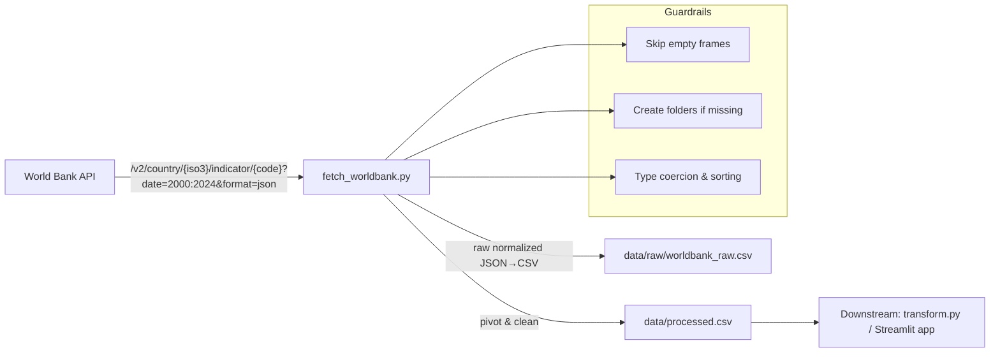

# Feature 01 — Data Fetch Pipeline (World Bank API)

**Branch:** `feature/data-fetch` → PR into `dev`
**Owner:** Arsh
**Status:** Draft → In Progress → Review → Merged

## 1) Goal & Outcome

Build a robust, reproducible pipeline to fetch selected World Bank indicators for multiple countries (2000–2024), persist **raw** and **processed** CSVs, and provide a clean interface for downstream transforms and the Streamlit app.

**Deliverables**

* `src/fetch_worldbank.py` (idempotent CLI script)
* `data/raw/worldbank_raw.csv`
* `data/processed.csv`
* Minimal docs + run instructions
* Placeholders to track `data/` in Git

---

## 2) Scope

**In**

* HTTP GET from World Bank API v2 (public, no auth)
* Indicators:

  * `NY.GDP.MKTP.KD.ZG` → gdp\_growth
  * `FP.CPI.TOTL.ZG` → inflation\_cpi
  * `SL.UEM.TOTL.ZS` → unemployment\_rate
  * `GC.DOD.TOTL.GD.ZS` → gov\_debt\_pct\_gdp
  * `BN.CAB.XOKA.GD.ZS` → current\_account\_pct\_gdp
* Countries: `IT, US, IN, BR, CN, ZA, DE`
* Years: 2000–2024
* Graceful handling of empties / sparse series (skip empties, forward-fill later)
* Directory creation on write

**Out**

* Heavy caching, retries/backoff (will come later if needed)
* Full validation framework / CI (next feature)

---

## 3) Architecture



---

## 4) Data Contracts

### 4.1 Raw CSV: `data/raw/worldbank_raw.csv`

| column          | type   | notes                                    |
| --------------- | ------ | ---------------------------------------- |
| country         | string | Country full name from API               |
| countryiso3code | string | ISO3 code                                |
| date            | int    | Year                                     |
| value           | float  | Indicator value (may be NaN)             |
| indicator       | string | Indicator code (e.g., NY.GDP.MKTP.KD.ZG) |

### 4.2 Processed CSV: `data/processed.csv`

* Index keys: `country, countryiso3code, year`
* Wide format: one column per **readable** indicator:

  * `gdp_growth`, `inflation_cpi`, `unemployment_rate`, `gov_debt_pct_gdp`, `current_account_pct_gdp`
* Sorted by `countryiso3code, year`
* Values can still have NaNs (forward-fill handled later in transform feature)

---

## 5) Implementation Details

### 5.1 Script Responsibilities (`src/fetch_worldbank.py`)

* Build URLs with `requests` and `params` (per\_page=20000, format=json)
* Normalize JSON → DataFrame (`pd.json_normalize`)
* Skip empty/all-NA frames (prevents concat dtype warnings)
* Concatenate & coerce dtypes (`date`, `value` → numeric)
* Pivot to wide with readable metric names
* Ensure directories exist: `os.makedirs("data/raw", exist_ok=True)`
* Save raw & processed CSVs
* Minimal `print()` summary on success

### 5.2 Config Constants

```python
COUNTRIES = ["IT","US","IN","BR","CN","ZA","DE"]
INDICATORS = {
  "NY.GDP.MKTP.KD.ZG": "gdp_growth",
  "FP.CPI.TOTL.ZG": "inflation_cpi",
  "SL.UEM.TOTL.ZS": "unemployment_rate",
  "GC.DOD.TOTL.GD.ZS": "gov_debt_pct_gdp",
  "BN.CAB.XOKA.GD.ZS": "current_account_pct_gdp",
}
START_YEAR, END_YEAR = 2000, 2024
```

### 5.3 Edge Cases & Handling

* **Empty API pages / country-indicator missing** → skip frame
* **All-NA `value`** → skip frame
* **Network hiccup** → raise with clear message (retries are out of scope here)
* **Data type drift** → coerce numeric with `errors="coerce"`

---

## 6) Non-Functional Requirements

* **Reproducible:** `python src/fetch_worldbank.py` yields same outputs given same API state
* **Fast:** < 10s typical on decent network; polite sleep if needed (0.2s)
* **Minimal deps:** `pandas, requests`
* **Idempotent writes:** overwrites existing CSVs cleanly

---

## 7) Testing Strategy (lightweight for this feature)

* **Smoke test (manual for this feature):**

  * After run, files exist; sizes > 0
  * `pd.read_csv("data/processed.csv")` has expected columns
* **Data sanity:**

  * Years within \[2000, 2024]
  * ISO3 codes subset equals configured countries

*(Automated pytest will come in Feature 5)*

---

## 8) Security & Compliance

* Public API, no secrets
* Respect API (optional small delay)
* License note in README for data source attribution

---

## 9) Run Instructions

```bash
# from repo root with venv activated
python src/fetch_worldbank.py

# outputs
# data/raw/worldbank_raw.csv
# data/processed.csv
```

---

## 10) Acceptance Criteria (DoD)

- `src/fetch_worldbank.py` runs without errors
- Writes **both** raw and processed CSVs
- Processed CSV has expected schema (keys + readable metric columns)
- Empties handled (no concat dtype warning)
- Folders auto-created when missing
- README updated with quick run steps
- Conventional commits used
- PR to `dev` includes this doc & screenshots of CSV head (optional)

---

## 11) Files to Add/Modify (this feature)

```
src/fetch_worldbank.py
data/.gitkeep
data/raw/.gitkeep
README.md                  # add minimal run section
docs/feature-01-data-fetch.md  # this plan
requirements.txt           # (pandas, requests, numpy optional)
.gitignore                 # .venv/, __pycache__/, data/*.tmp
```

---

## 12) Conventional Commits (suggested)

* `feat(fetch): add World Bank data fetch pipeline (raw + processed)`
* `chore(docs): add feature-01 implementation plan & run instructions`
* `chore(repo): add data folder keepers and .gitignore`

---

## 13) PR Template (paste into PR description)

**Title:** `feat: add World Bank data fetch pipeline (raw + processed)`

**Summary:**
Implements data ingestion from World Bank for 5 indicators across 7 countries (2000–2024). Persists raw & processed CSVs with guardrails for empties and type coercion.

**Checklist**

* [ ] Runs locally (`python src/fetch_worldbank.py`)
* [ ] `data/raw/worldbank_raw.csv` and `data/processed.csv` created
* [ ] Docs updated (`docs/feature-01-data-fetch.md`, README)
* [ ] Conventional commits
* [ ] Screenshots of `head()` (optional)

---

## 14) Follow-up / Next Feature

After merge to `dev`, create: **`feature/transform-pipeline`**

* Move forward-fill & normalization to `src/transform.py`
* Add small tests and prep for Streamlit app MVP

---

**End of plan.**
